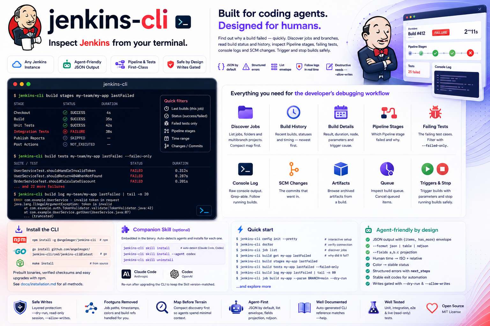

# jenkins-cli

[](https://www.npmjs.com/package/@angelmsger/jenkins-cli)
[](go.mod)
[](LICENSE)
[](https://angelmsger.github.io/jenkins-cli/)

> Inspect Jenkins from your terminal — built for coding agents.

`jenkins-cli` lets coding agents (Claude Code and others) — and humans — inspect
[Jenkins](https://www.jenkins.io/) for a developer's debugging workflow: discover
jobs, folders and multibranch branches; read build status and history; and find
out *why* a build failed — which pipeline stage broke, the failing test cases,
the console log, and the SCM commits that went in. It can also trigger and stop
builds. It works with any Jenkins instance, returns agent-friendly JSON with
structured errors, and ships a companion Skill that teaches an agent how to use
it.

📖 **Documentation site:** <https://angelmsger.github.io/jenkins-cli/>



```console
$ jenkins-cli build get my-app lastFailed
{
  "number": 412, "result": "FAILURE", "status": "failure", "building": false,
  "started_at": "2026-06-16T09:14:02Z", "started_ago": "3h ago", "duration": "2m11s",
  "built_on": "linux-agent-2",
  "causes": [ { "description": "Started by GitHub push by alice", "user_id": "alice" } ]
}
```

## Features

- **The developer's debugging loop** — `job list` / `job get` to discover, `build
  list` for history, `build get` for one build's result and timing, and then the
  *why*: `build stages` (which Pipeline stage failed), `build tests --failed-only`
  (the failing cases), `build log` (console output), `build changes` (the commits).
- **Map before terrain** — `job list` returns a compact, `?tree=`-shaped view
  (name, type, status, last-build pointer) so an agent sees the shape before
  pulling a full job or a large console log.
- **The CLI owns the footguns** — human job paths (`folder/job/PR-12`) are
  converted to Jenkins' `/job/.../job/...` form; the `color` field becomes a
  stable `status`; epoch-millisecond timestamps come back as both an ISO instant
  and a relative phrase; build refs accept `lastFailed` & friends.
- **Agent-friendly output** — JSON by default, a `{items, has_more}` list
  envelope, `--format json|table|ndjson`, and `--fields` projection to spend
  minimal context. `build log` prints raw, grep-able console text.
- **Errors as navigation** — every failure is structured
  (`category`/`code`/`hint`/`next_steps`) and mapped to a stable exit code, so a
  script or agent can branch and self-recover.
- **Layered write safety** — the three writes (`job build`, `build stop`, `queue
  cancel`) support `--dry-run`, honour a session read-only posture, and require
  `--allow-writes` to override it; CSRF crumbs are handled automatically.
- **Flexible configuration** — CLI flags, environment variables, a `.env` file, a
  YAML config file, or an interactive wizard; multiple named server *contexts*;
  secrets stored in the OS keychain.
- **Companion Skill** — a `jenkins` Skill, embedded in the binary, that guides
  coding agents (Claude Code, Codex) through the CLI.

> **Scope (v0.1):** a developer's inspection workflow over jobs and builds, plus
> the two high-frequency writes (trigger / stop a build) and queue cancel.
> Jenkins' control plane — creating and configuring jobs, credentials, nodes,
> Configuration-as-Code — is on the roadmap; the read-only wrapper and `--dry-run`
> gates are already wired so those write methods drop in cleanly.

## Installation

### 1. Install the CLI — npm (recommended)

```bash
npm install -g @angelmsger/jenkins-cli
```

npm downloads the prebuilt binary for your platform, verifies its SHA-256
checksum, and keeps upgrades one `npm update -g @angelmsger/jenkins-cli` away.

<details>
<summary><strong>Other install methods</strong> — go install, source build, prebuilt binary</summary>

```bash
go install github.com/angelmsger/jenkins-cli/cmd/jenkins-cli@latest   # go 1.24+
make install                                                          # from a source checkout
```

Or download a prebuilt binary from the
[Releases page](https://github.com/AngelMsger/jenkins-cli/releases). The full
[installation guide](docs/installation.md) covers every method, shell completion
and the companion Skill.

</details>

### 2. Deploy the companion Skill

The `jenkins` Skill is embedded in the binary; it teaches your coding agent
(**Claude Code**, **Codex**) how to drive the CLI. `skill install` probes for
installed agents and installs into each one found:

```bash
jenkins-cli skill install            # auto-detect; install for each agent found
jenkins-cli skill install --agent codex
jenkins-cli skill uninstall          # remove it again
```

Re-run it after upgrading the CLI to keep the Skill version-matched.

### 3. Enable shell completion (optional)

```bash
source <(jenkins-cli completion bash)                     # bash, current shell
jenkins-cli completion zsh > "${fpath[1]}/_jenkins-cli"   # zsh, persistent
```

fish and PowerShell are supported too — see `jenkins-cli completion --help`.

## Quick start

```bash
jenkins-cli config init --pretty  # interactive TUI setup (recommended for humans)
jenkins-cli doctor                # verify configuration and connectivity

jenkins-cli job list                       # discover jobs (the map)
jenkins-cli job get my-team/my-app          # one job: params, branches, last builds

# why is the latest build red?
jenkins-cli build get my-app lastFailed         # result, timing, what triggered it
jenkins-cli build stages my-app lastFailed      # which Pipeline stage failed
jenkins-cli build tests my-app lastFailed --failed-only   # the failing test cases
jenkins-cli build log my-app lastFailed | tail -n 80      # the console output

# trigger and watch a build (writes; preview first)
jenkins-cli job build my-app --param BRANCH=main --dry-run
jenkins-cli job build my-app --param BRANCH=main --allow-writes
jenkins-cli build log my-app --follow           # stream a running build to completion
```

## Configuration

Settings resolve in precedence order (highest first): CLI flags → environment
variables (`JENKINS_*`) → `.env` → `~/.angelmsger/jenkins/config.yaml` →
defaults. Secrets are stored in the OS keychain. If Windows Credential Manager
is unavailable, the fallback is encrypted with per-user DPAPI; macOS/Linux
retain the `0600` fallback. Secrets are never written to the config file.

Authenticate with your Jenkins **username + API token** (User → Configure → API
Token). For headless / CI / agent use, configure entirely from the environment:

```bash
export JENKINS_URL=https://jenkins.example.com
export JENKINS_USER=alice
export JENKINS_TOKEN='11abc…your-api-token'   # …or JENKINS_PASSWORD for basic auth
```

## Commands

| Command | Purpose |
|---------|---------|
| `job list` | list jobs / folders / multibranch projects (the discovery map) |
| `job get` | one job: parameters, health, branch jobs, last-build pointers |
| `job build` | trigger a build (write; `--param K=V`, `--dry-run`) |
| `build list` | a job's recent build history (newest first) |
| `build get` | one build: result, timing, node, trigger cause, parameters |
| `build log` | the console output (raw text; `--follow` to stream a running build) |
| `build stages` | a Pipeline build's per-stage status — which stage failed |
| `build tests` | the test report (`--failed-only` for just the failures) |
| `build changes` | the SCM commits a build picked up |
| `build artifacts` | a build's archived artifacts |
| `build stop` | abort a running build (write) |
| `queue list` / `get` / `cancel` | inspect the build queue; cancel a queued build (write) |
| `auth login` / `status` / `logout` | store credentials, check identity, sign out |
| `config init` / `show` / `contexts` / `use-context` | setup, inspect, manage servers |
| `doctor` | check configuration, credentials and connectivity |
| `skill install` / `uninstall` | deploy or remove the embedded companion Skill |
| `version` | print version and build information |

In the default JSON output, list commands return a `{items, has_more}` envelope;
`--format ndjson` instead streams the items themselves, one JSON object per line.
`--fields a,b.c` projects output down to specific dot-paths. A build reference is
a number or a permalink keyword: `last`, `lastSuccessful`, `lastFailed`,
`lastCompleted`, `lastStable`.

### Multiple servers (contexts)

A single config file can hold several Jenkins servers as named *contexts*. Most
users need only one and never see the concept. When a config already exists,
re-running `config init` lists it and asks whether to **edit** a context, **add**
a new one, or **replace** everything; pass `config init --context prod` to skip
that prompt. Then:

```bash
jenkins-cli config contexts                 # list contexts, current marked
jenkins-cli config use-context prod         # switch the current context
jenkins-cli --use-context prod job list     # override for one command
```

`JENKINS_CONTEXT` overrides the current context via the environment.

## Errors and exit codes

Failures are JSON on **stderr** (stdout stays a clean data channel) and map to
stable exit codes: `0` success, `2` usage, `3` config, `4` auth, `5` permission,
`6` not found, `7` rate limit, `8` network, `9` server, `10` parse, `11` conflict.
Each error carries `next_steps` naming the command to run next, and `retryable`
to guide back-off.

## Use as a Go library

The HTTP client that powers the CLI is published as a standalone Go package, so a
GUI or other tool can drive Jenkins directly — same normalized models and
structured errors, without shelling out to the binary.

```go
import (
	"context"
	"encoding/base64"
	"net/http"
	"os"

	api "github.com/angelmsger/jenkins-cli/pkg/apiclient"
	cerr "github.com/angelmsger/jenkins-cli/pkg/errors"
	"github.com/angelmsger/jenkins-cli/pkg/transport"
)

// Authentication is a transport.Decorator you supply — it sets the
// Authorization header on every request. Jenkins uses HTTP Basic (user + API token):
func basic(user, token string) transport.Decorator {
	header := "Basic " + base64.StdEncoding.EncodeToString([]byte(user+":"+token))
	return func(r *http.Request) { r.Header.Set("Authorization", header) }
}

ctx := context.Background()
client, err := api.BuildClient(api.BuildParams{
	BaseURL:       "https://jenkins.example.com",
	AuthDecorator: basic(os.Getenv("JENKINS_USER"), os.Getenv("JENKINS_TOKEN")),
})
if err != nil { /* see error handling below */ }

jobs, err := client.ListJobs(ctx, "", 0) // folder "" = instance root
```

Errors are `*errors.CLIError` with a stable `Category` and `Code`, so callers branch
on failure kinds instead of parsing strings:

```go
if ce := cerr.AsCLIError(err); ce != nil {
    // ce.Category, ce.Code, ce.Hint, ce.NextSteps, ce.HTTPStatus, ce.Retryable
}
```

> These `pkg/...` packages primarily back this CLI and its companion Skill; their
> exported surface is treated as a stable contract. Read the package doc comment
> (`go doc ./pkg/apiclient`) before changing it.

## Development

```bash
make build      # compile to ./bin/jenkins-cli
make test       # unit + httptest integration tests
make e2e        # build + run against an in-repo mock Jenkins server
make lint       # gofmt + go vet
make docs       # regenerate the CLI reference under docs/cli/
```

[`CONTRIBUTING.md`](CONTRIBUTING.md) covers the conventions and commands;
[`docs/technical-design.md`](docs/technical-design.md) the architecture, and
[`docs/releasing.md`](docs/releasing.md) the release process. The `docs/cli/`
reference is generated from the cobra command tree by `cmd/gen-docs`, so it
always matches `--help` — run `make docs` after changing a command or flag, and
commit the result (CI fails if it drifts). See [`CHANGELOG.md`](CHANGELOG.md) for
the version history.

## Related

Part of a family of agent-facing CLIs — one skeleton, one set of conventions, all
built for coding agents. Browse the full set at
**[github.com/AngelMsger](https://github.com/AngelMsger)**:

- **[confluence-cli](https://github.com/AngelMsger/confluence-cli)** — Confluence as a knowledge base
- **[bitbucket-cli](https://github.com/AngelMsger/bitbucket-cli)** — Bitbucket pull requests & code review
- **[openobserve-cli](https://github.com/AngelMsger/openobserve-cli)** — OpenObserve logs, metrics & traces
- **jenkins-cli** — inspect Jenkins jobs & builds *(this project)*
- **[jira-cli](https://github.com/AngelMsger/jira-cli)** — Jira issues & workflow transitions

## License

Released under the [MIT License](LICENSE).
